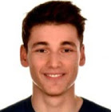

# Diego Martínez Baselga
- PhD student in University of Zaragoza
- diegomartinez@unizar.es
- 

## Education
### B.S. in Computer Engineering in University of Zaragoza (2016-2020)
- Relevant subjects: Machine Learning, Artificial Intelligence, Systems Management, Computer Vision, Graphics, Image and Video Processing...
- Bachelor Thesis: Anomaly detection with Prometheus.
- Grade point average: 8.77/10
### Erasmus Program in Tampere University (2019-2020)
### M.S. in Robotics, Graphics and Computer Vision (2020-2022)
- Relevant subjects: Autonomous Robots, Computer Vision, Machine Learning, Modeling and Simulation of Appearance, Programming and Architecture of Computing Systems, Computational Imaging, Simultaneous Localization and Mapping, Advanced SLAM, Assistive Robotics, Multirobot Systems..
- Master Thesis: Robot navigation in dynamic environments using learning based techniques
- Grade point average: 9.35/10

## Experience
### Research Assistant in Tampere University (2019-2020)
- Research assistant in the Cloud and Web Engineering Research Group (CloWeE).
### Collaboration grant in University of Zaragoza (2020)
- The development of planning and navigation techniques with several robots in highly dynamic scenarios, in order to avoid collision while minimising the time to reach the goal. The goal of this grant was progressing in one of the research lines of the Robotics, Perception and Real Time (RoPeRT) group of the University of Zaragoza, where only scenarios with one active agent had been considered. Several techniques of sharing the decision making process were explored in different scenarios, using LIDAR sensors in real ground robots. The Robotics Operating System (ROS) was used.
### Intenship in University of Zaragoza (2020-2021)
- The development of a distributed software architecture in ROS, defining a complete navigation stack. The implementation of robot navigation techniques based on deep reinforcement learning. The system may include different numbers of agents (robots or even people). The implementation of autonomous motion techniques, navigation and autonomous decision making for active agents, by using 2D LIDAR sensors to predict the localization and velocity of the rest of elements in the scenario. The evaluation was performed with real ground robots.

### PhD student in University of Zaragoza (2021-now)
- In the fist part of the PhD I am focusing in autonomous robot navigation. I am studying, experimenting and developing algorithms that are based on deep reinforcement learning for robot navigation in highly dynamic environments, with multiple robots or other kind of agents.

## Publications
Francesco Lomio, Diego Martínez Baselga, Sergio Moreschini, Heikki Huttunen, and Davide Taibi. 2020. RARE: a labeled dataset for cloud-native memory anomalies. In Proceedings of the 4th ACM SIGSOFT International Workshop on Machine-Learning Techniques for Software-Quality Evaluation (MaLTeSQuE 2020). Association for Computing Machinery, New York, NY, USA, 19–24. DOI:https://doi.org/10.1145/3416505.3423560

## Teaching
### 2021-2022
- Robots Autónomos in B.S. in Electronic and Automatic Engineering
- Robótica in B.S. in Computer Engineering

## Skills
### Programming Languajes
- Python, C++, Matlab, C, Java, Bash, SQL, R, Ruby, JavaScript, OpenGL, Elixir

### Frameworks and libraries
- ROS, Tensorflow, Pytorch, OpenCV, Gym, Matplotlib, Numpy, OpenCL

### Languages
- Spanish (Native)
- English: Certificate in Advanced English (C1)
- French: DELF B1

## Extra
- Second prize of the 2021 Autonomous Driving Challenge, organized by Carnet, Seat, Volkswagen and UPC.
- First prize in the I Rendering Competition of the Master in Robotics, Graphics and Computer Vision of the University of Zaragoza.
- Driving License B1.
